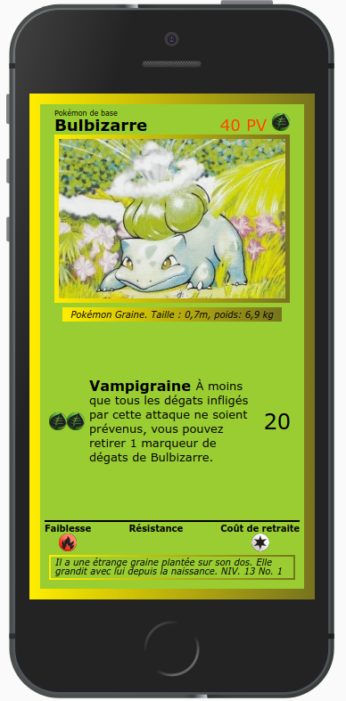
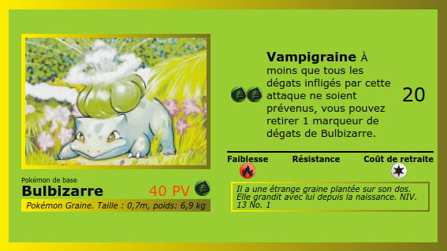
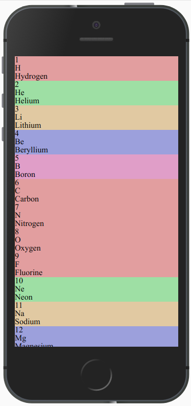
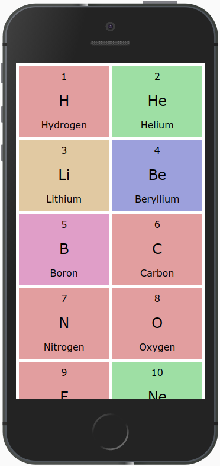
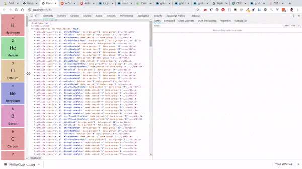
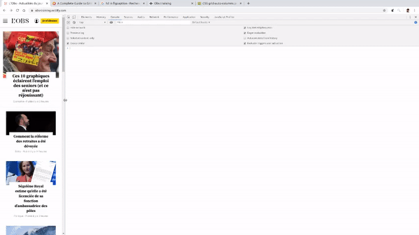

# Responsive flexbox & grid

## Partie 1 : Flexbox

### Entraînement

Pour se familiariser avec les différentes propriétés :
[Flexbox Froggy](https://flexboxfroggy.com/#fr)

### TP : à vous !

Le but de l'exercice est de reproduire une célèbre carte à jouer en utilisant les propriétés flexbox. Voici le modèle :


#### Étape 0 : Configuration VSCode

- Créer un fork de ce repository
- Cloner le fork : le dossier `tp/pokemon` sera la racine de votre TP.
- Installer le plugin _Prettier_
  - Dans les options :
    - Cocher "Format on save"
    - Régler "Default formatter" sur "...prettier..."
  - Vérifier le bon fonctionnement sur les fichiers HTML et CSS (à la sauvegarde, le code est-il reformaté ?)
- Installer le plugin _Live Server_
  - Vérifier qu'un fichier HTML peut-être ouvert avec le bouton "Go Live" en bas à droite (auto-refresh du navigateur)

#### Étape 1 : Les fondations (HTML sauce BEM)

- Comprendre la méthodologie BEM : [ici](https://www.alticreation.com/bem-pour-le-css/) (français) ou [là](https://css-tricks.com/bem-101/)
- Déterminer quels sont les blocs constituant la carte (une demi-douzaine, selon le choix de découpage), et leur donner un nom simple
- Écrire le HTML correspondant, sans CSS pour le moment
  - Les images sont dans le dossier `assets/img`

Résultat approximatif à cette étape :


Attention à vérifier la présence de la balise _meta viewport_ pour un bon dimensionnement sur mobile !

```
<meta name="viewport" content="width=device-width, initial-scale=1.0" />
```

- Solliciter une vérification de ma part, attendre la correction ou continuer si tout se passe bien !
- `git commit` avant de passer à la suite

#### Étape 2 : Styling SCSS

- Afin de pouvoir utiliser SCSS :
  - Dans le dossier de travail, transformer votre projet simple en projet npm avec `npm init`
  - Installer [parcel](https://parceljs.org/) avec `npm install parcel --save-dev`
  - Dans `package.json`, ajouter un script `"serve": "parcel index.html"`
  - Lancer `npm run serve`. Parcel _build_ votre site et l'ouvre dans le navigateur, sur _localhost_.
- Ajouter un fichier `styles.scss` à votre projet et l'importer à partir du HTML. Parcel s'occupera de la transformation en CSS.
- Ajouter un fichier `reset.scss` à votre projet contenant le [reset CSS classique](https://meyerweb.com/eric/tools/css/reset/), sans l'importer dans le HTML.
- Dans le fichier `styles.scss`, utiliser un import SASS pour importer le fichier `reset.scss`.

Dans vos projets, toujours inclure les deux règles CSS suivantes (rappel sur [box-sizing](https://developer.mozilla.org/fr/docs/Web/CSS/box-sizing)) :

```
* {
  box-sizing: border-box;
}

img {
  max-width: 100%;
}
```

Propriétés "interdites" pour cet exercice :

- `width`
- `height`
- `float`
- `position`
- `transform`
- `display` autre que `display: flex`

Votre but est maintenant de reproduire la carte sur un écran de type iPhone5 (320\*568). Il vous appartient de pousser la ressemblance avec l'original au maximum, mais voici un exemple :



- En accord avec la convention BEM :
  - Utilisez quasiment exclusivement des sélecteurs de classe
  - Évitez au maximum les imbrications. SASS sera utile, mais surtout pour la suite.
- Solliciter une vérification de ma part, attendre la correction ou continuer si tout se passe bien !
- `git commit` avant de passer à la suite

#### Étape 3 : Mode paysage

On souhaite adapter la carte à un mobile de la même taille en mode paysage (568\*320), autrement dit lorsque la largeur est plus grande que la hauteur.
Pour ce faire, vous pouvez ajouter une mixin SASS en début de fichier :

```
@mixin landscape {
  @media (min-aspect-ratio: 1/1) {
    @content;
  }
}
```

Grâce à cette mixin, vous pouvez écrire :

```
.selector {
  color: red;

  @include landscape {
    color: blue;
  }
}
```

Cela permet d'inclure les variations au plus proche du sélecteur de base, au lieu de tout écrire en fin de fichier, ce qui rend le code plus maintenable / lisible.

Voici le nouvel objectif à atteindre :



- Solliciter une vérification de ma part ou attendre la correction
- `git commit` pour finir

#### Étape 4 : Rendu

Rendez votre travail en créant une pull request de votre repository de travail vers ce repository.

## Partie 2 : Grid

### Entraînement

Pour se familiariser avec les différentes propriétés : [Grid Garden](https://cssgridgarden.com/#fr)

### TP : à vous !

Le but de ce TP est d'utiliser CSS Grid pour intégrer simplement un tableau complexe : le tableau périodique des éléments.


Le tableau interactif (mais non responsive !) qui nous servira de référence se trouve [ici](https://www.ptable.com/?lang=en).

#### Étape 0 : mise en place

Voir l'étape 0 du TP flexbox.

#### Étape 1 : Comprendre le tableau et le HTML

Le fichier `index.html` contient déjà ce qu'il nous faut : la liste de tous les
éléments.

_Note : Pour simplifier, nous allons ignorer les deux lignes "externes" au tableau pour le moment (en bas). On laissera deux cases vides au sein du tableau principal. C'est pourquoi les éléments correspondants sont commentés dans le HTML._

Voici par exemple l'**Argon** en BEM (rappel : l'élément `<abbr>` représente une abbréviation):

```
<article class="el el--nobleGas" data-period="3" data-group="18">
  <p class="el__number">18</p>
  <abbr class="el__symbol">Ar</abbr>
  <p class="el__name">Argon</p>
</article>
```

Prenez le temps de bien comprendre chaque information, en comparant avec le tableau de référence :

- `el--nobleGas` : modificateur BEM désignant le type d'élement. L'argon est un gaz noble.
- `data-period="3"` : attribut désignant la ligne sur laquelle se trouve l'élément (la période, pour les intimes). L'argon se trouve sur la troisième ligne.
- `data-group="18"`: attribut désignant la colonne sur laquelle se trouve l'élément (le groupe). L'argon se trouve sur la dix-huitième colonne.

À vous de jouer :

- L'oxygène a été retiré du fichier `index.html` : rajoutez-le.
- Il est déjà temps d'effectuer un petit `commit` pour conclure cette introduction.

#### Étape 2 : Un peu de couleur avec SCSS

Suivez à nouveau la procédure pour installer `parcel` dans votre dossier de travail.

Le but de cette étape est d'associer à chaque élément une couleur de fond en fonction de son type (gaz noble, métalloide...).



Les couleurs du tableau périodique ne sont pas normalisées, il est donc possible de les choisir, tant que un type === une couleur.
Tout d'abord, utilisez `lightgrey` sur le sélecteur `.el`, pour que les éléments sans type soient en gris à la fin.

Pour le reste des couleurs, plutôt que de le faire à la main, utilisons les fonctionnalités avancées de SASS :

- [Lists](https://sass-lang.com/documentation/values/lists) (pour contenir les types)
- [Boucle each](https://sass-lang.com/documentation/at-rules/control/each) ou [boucle for](https://sass-lang.com/documentation/at-rules/control/for) (pour itérer dessus)
- [Couleurs HSL](https://sass-lang.com/documentation/modules#global-functions)(en faisant varier le paramètre hue entre 0 & 360, vous obtiendrez différentes teintes)
- Les fonctions `$length`, `$nth`, `$index`...

Plusieurs syntaxes sont possibles, mais le résultat doit occuper moins de 10 lignes.

Pour vous aider à démarrer, voici la liste des types au format SCSS :

```
$types: alkaliMetal lanthanide nobleGas transitionMetal postTransitionMetal alkalineEarthMetal actinide metalloid otherNonMetal;
```

Une fois ceci fait, `git commit` !

#### Étape 3 : Grille mobile

Les propriétés suivantes seront exclues :

- `width`
- `height`
- `float`
- `position`
- `transform`
- `display` autre que `display: flex` ou `display: grid`

Le tableau ne peut pas être représenté dans sa forme classique sur mobile, mais on peut l'adapter. Sur mobile, on souhaite présenter les éléments "en bloc" :



Et voici le comportement responsive souhaité, tant que l'écran n'est pas assez grand pour présenter la mise en forme classique :



Vous aurez besoin :

- De transformer le `body` en grille
- De définir la hauteur des `rows`, peu importe combien il y en a
- De définir les `columns`, variant d'un minimum à un maximum, mais remplissant toujours l'espace horizontal

Un peu [d'inspiration](https://codepen.io/chriscoyier/pen/ecff0af160b3fd32cf67841b1eb6cfc3) pour résoudre ce problème !

N'oubliez pas le `commit` de fin d'étape.

#### Étape 4 : Grille classique

Inspirez vous de l'étape 3 du TP Flexbox pour écrire une `mixin` vous permettant de cibler les écrans de taille supérieure à `1400px`.

_Note : pour ne pas être gêné par la longueur du nom de certains éléments (#rutherfordium), je vous conseille de réduire leur font-size à 10px._

Utilisez cette `mixin` pour re-définir sur le `body` les `rows` et les `columns`, dont vous connaissez maintenant le nombre (pour rappel, on ignore les deux lignes du bas sur le tableau classique).

Indice : le mot-clé `repeat` vous sera utile à deux reprises.

Comme les éléments ne sont pas encore correctement placés, le résultat va ressembler à ça :


_Note : vous pouvez-voir où sont les cellules de la grille en survolant les éléments dans l'inspecteur._

`git commit`

#### Étape 5 : Placer les éléments

Rappelez-vous : chaque élément possède des attributs `data-period` et `data-group`, définissant respectivement leur ligne et colonne.

Vous pouvez placer les éléments dans la grille en combinant :

- [Boucle for SASS](https://sass-lang.com/documentation/at-rules/control/for)
- [Sélecteurs d'attribut](https://developer.mozilla.org/fr/docs/Web/CSS/S%C3%A9lecteurs_d_attribut)
- `grid-row` & `grid-column`

10 lignes vous suffiront, à ajouter à nouveau avec `git commit`.

Le résultat attendu :


Félicitations, vous avez complété le TP. Vous pouvez aller plus loin (voir section suivante) ou soumettre votre travail via une pull request.

#### Aller plus loin

Le [tableau](https://www.ptable.com/?lang=en) n'est pas complet ! Il manque les **lanthanides** et les **actinides**, qui ont la particularité d'être souvent représentés en dessous du tableau principal.

À vous de trouver comment modifier la grille pour afficher ces éléments. Ils sont déjà présents dans le HTML, il vous suffit de retirer les commentaires. Modifiez le HTML selon vos besoins.

#### Aller encore plus loin

Et si l'écran était assez large pour afficher les **lanthanides** et les **actinides** dans le tableau principal, et pas dans des lignes externes ?

C'est ce que vous pouvez voir en cliquant sur le bouton _wide_, en haut à droite du [tableau](https://www.ptable.com/?lang=en).

Ajoutez une media query pour les très grands écrans pour afficher le tableau complet.


## Partie 3 : flex & grid en contexte réel

Dans le dernier TP de cette série, nous allons intégrer une page web étape par étape en utilisant intelligement flexbox et grid.

La page à intégrer est [une version simplifiée du site de l'Obs](https://obs-training.netlify.com/).



L'ouverture du menu et de la recherche ne font pas partie des objectifs.

Les images et fonts sont dans `tp/obs/assets`.

_Note : il est inutile de se fier au code source du site modèle en l'inspectant : le but ici est de créer une version plus simple, utilisant des technologies plus modernes._

### Étape 0 : mise en place

Voir l'étape 0 du TP flexbox, puis l'étape 2 pour l'utilisation de SCSS (le dossier de travail étant ici `tp/obs`). N'oubliez pas de commiter votre travail à la fin de chaque étape.

### Étape 1 : Les media queries

Identifiez les _breakpoints_ (dimensions de l'écran auxquelles la mise en page change). La taille la plus petite qu'on souhaite supporter sera `320px`. Partez de cette largeur, puis agrandissez le viewport pour détecter les 2 _breakpoints_ principaux. Notez la taille.

_Note : le header contient plus de variations, ignorez pour l'instant._

Dans un fichier `tp/obs/css/config/medias.scss`, définissez des mixins pour vos _media queries_. En _mobile first_, on part du plus petit pour aller vers le plus grand :

```
@mixin medium {
  @media (min-width: ???px) {
    @content;
  }
}

@mixin large {
  @media (min-width: ???px) {
    @content;
  }
}
```

Puis importez ce fichier de configuration dans votre fichier `scss` principal (celui qui est inclus par `index.html`) :

```
@import "config/medias";
```

Vous pouvez maintenant écrire votre code responsive ainsi, faites le test :

```
body {
  background-color: green;

  @include medium {
    background-color: yellow;
  }

  @include large {
    background-color: red;
  }
}
```

Ces mixins vous permettent de voir en coup d'oeil ce qui arrivera à votre élément en fonction de la taille de l'écran, c'est très lisible. Par ailleurs, vous n'aurez jamais à répéter un sélecteur : les _media queries_ sont incluses dedans, et non l'inverse (CSS classique).

### Étape 2 : le squelette

Commencez à analyser la page modèle. Que voyez-vous ?

On peut distinguer trois parties principales, que vous pouvez retranscrire dans votre html.

```
<body>
  <header class="header"></header>
  <main class="main"></main>
  <footer class="footer"></footer>
</body>
```

_Note : les classes semblent redondantes par rapport aux balises, mais elles vont nous permettre d'utiliser la convention BEM. Par ailleurs, un document peut contenir plusieurs `header`, `main` et `footer`, il serait donc risqué de se baser sur le nom des balises._

Les trois éléments pourront avoir chacun leur fichier de style, à inclure au fichier principal :

```
@import "blocs/header";
@import "blocs/main";
@import "blocs/footer";
```

_Note : ces trois blocs BEM sont très grands (surtout `main`). Ils vont donc contenir d'autres blocs BEM plus réduits (`article`, `info`...)._

### Étape 3 : la grille

Sur le site modèle, observez le `main`, c'est à dire tout le site à l'exception du `header` et du `footer`. Voyez-vous la grille ? Vous pouvez déjà mettre à jour le code :

```
.main {
  display: grid;
}
```

Commencez par analyser la grille dans sa forme la plus complexe : en écran large. Combien voyez-vous de lignes et de colonnes ?

_Rappel : actuellement en CSS, seuls les enfants directs peuvent être positionnés dans la grille. Vous devez donc ignorer les "sous-grilles" potentielles._

Avec un papier et un crayon, faites un schéma de la grille. Essayez de trouver les six enfants et de les placer sur votre schéma. Voici le genre de schéma dont on parle (même si dans notre cas, le header et le footer ne font pas partie de la grille) :


Dans le cas de notre site modèle, on pourrait appeler le premier enfant `primaryInfo`. Il se situe sur la première ligne, et sur les deux premières colonnes.

Mettez à jour votre HTML en conséquence :

```
<main class="main">
  <section class="main__primaryInfo primaryInfo">hello !</section>
  ...les cinq autres enfants...
</main>
```

_Note : la `section` est à la fois un enfant de main (donc `main__primaryInfo`), qu'on pourra ainsi placer dans la grille, mais aussi un bloc à part entière (donc `primaryInfo`), qui aura son propre fichier de style._

Diminuez votre viewport pour atteindre la taille intermédiaire. Vous pouvez constater que `main` n'est plus une grille : si on considère **uniquement** les six enfants précedemment établis, les éléments sont placés naturellement dans le flux, de haut en bas. Cela peut être traduit ainsi dans le code :

```
.main {
  @include large {
    display: grid;
  }
}
```

_Note : Les "sous-grilles" seront traitées plus tard dans le TP._

À vous désormais de configurer la grille pour obtenir une mise en page fidèle au site modèle. N'oubliez pas que vous avez d'[excellentes documentations](https://css-tricks.com/snippets/css/complete-guide-grid/). Voici une structure de base si vous avez besoin d'aide :

```
.main {
  @include large {
    display: grid;
    grid-template-columns: ???;
    grid-template-rows: ???;
    grid-template-areas: ???;
  }
}

.main__primaryInfo {
  background: yellow; /* Pour tester */
  height: 100px; /* Pour tester */

  @include large {
    grid-area: ???;
  }
}

```

Voici le style de résultat attendu, ici pour une grille complètement différente (la votre sera plus simple):


Cette étape étant critique, je vous recommande de solliciter une validation de ma part à ce moment là.

### Étape 4 : encore des grilles ?

Deux autres grilles sont identifables dans le site modèle, à des niveaux plus profonds. Ces deux grilles sont cette fois-ci actives sur les écrans larges **et** intermédiaires.

Identifiez-les et refaites le même exercice : schéma sur papier, puis mise en place du code, **responsive inclus**.

_Rappel : un élément de grille peut lui-même être en `display: grid`._

### Étape 5 : les blocs

Tout est en place pour passer à l'intégration détaillée, bloc par bloc.

Quand vous abordez un bloc, commencez par écrire son HTML. Par exemple :

```
<section class="main__primaryInfo primaryInfo">
  
  <h2 class="primaryInfo__title">Ces 10 graphiques éclairent l'emploi des seniors (et ce n'est pas réjouissant)</h2>
  <p class="primaryInfo__meta">Économie - Publié il y 2 heures</p>
</section>
```

Puis passez au CSS, toujours en _mobile first_ et en utilisant les _mixins_.

Quelques infos supplémentaires :

- Vous devrez déclarer les fonts (disponibles dans le dossier `tp/obs/assets/fonts`). Utilisez pour cela un fichier `css/config/fonts.scss` et les déclarations `@font-face`.
- Si des valeurs semblent se répéter (tailles de typos, couleurs...), utilisez des variables CSS stockées dans `css/config` pour les ré-utiliser dans les fichiers de bloc.
- Vous pouvez également déclarer des styles globaux (`font-family` et `color` du `body` par exemple), dans un dossier `css/global`, en organisant les fichiers selon ce qui vous semble le mieux.
- Certains sous-blocs se ressemblent ? Pensez aux _modifiers_ BEM (par exemple l'info principale et les cinq infos secondaires).

Bonne chance !

## Ressources

- En cas de besoin : [Exercices HTML/CSS](https://htmlcss2018.netlify.com/)
- [Méthode BEM](http://getbem.com/introduction/)

### Flexbox

- Reférence : [CSS Tricks Guide](https://css-tricks.com/snippets/css/a-guide-to-flexbox/)
- Outil : [Flexulator, calculateur de flexbox](https://www.flexulator.com/)
- Entraînement : [Flexbox Froggy](https://flexboxfroggy.com/#fr)

### Grid

- Reférence : [CSS Tricks Guide](https://css-tricks.com/snippets/css/a-guide-to-flexbox/)
- Outil : [Grid generator](https://grid.layoutit.com/)
- Entraînement [Grid Garden](https://cssgridgarden.com/#fr)
- Exemple : [grid-auto-flow: dense](https://codepen.io/imjuangarcia/pen/bzpYyj)
- Le futur [Subgrid](https://dev.to/kenbellows/why-we-need-css-subgrid-53mh)
